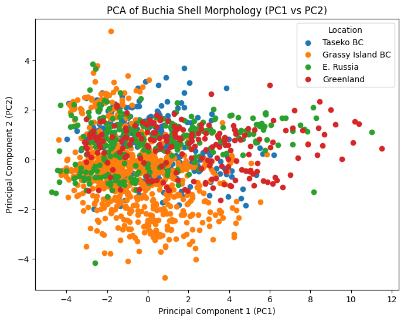

# Buchia PCA Analysis

This project uses **Principal Component Analysis (PCA)** to analyze shell morphology data from Buchia fossils. I did this as part of a class assignment, and I found it interesting to see how data analysis and machine learning can be applied to real scientific data.

## What This Project Does (Simple Explanation)

In this project, I am working with measurements of fossil shells. Each shell has 10 different features like length, width, and shape.

The problem is that it is hard to understand patterns when there are many features.

So I used **Principal Component Analysis (PCA)** to reduce these 10 features into a few new ones (called principal components) that still keep most of the important information.

This makes it easier to:
- understand the data  
- visualize it in graphs  
- see patterns or differences between samples  

In simple terms, PCA helps turn complex data into something easier to understand while keeping most of the meaning.

## Project Overview

The dataset contains over 1500 samples with 10 features that describe shell shape and size. The goal was to explore patterns in the data and reduce it into a few important components using PCA.

## What I Did

- Loaded and explored the dataset using Python  
- Selected the numeric features for analysis  
- Checked for missing values  
- Standardized the data  
- Applied PCA using scikit-learn  
- Calculated variance explained by each component  
- Created 2D and 3D plots  

## Results

- PC1 explains about 66% of the variation  
- PC2 explains about 18%  
- PC3 explains about 6%  

Together, the first three components explain most of the data.

## Sample Plot

## What I Learned

This project helped me understand how PCA works and why preprocessing steps like standardization are important. I also learned how to visualize and interpret results from real datasets.

## Tools Used

- Python  
- pandas  
- matplotlib  
- scikit-learn  

## References

- Grey, K. (2008). *Palaeontology Study on Buchia Fossils*.  
  This paper provides background context for the dataset used in this project.
